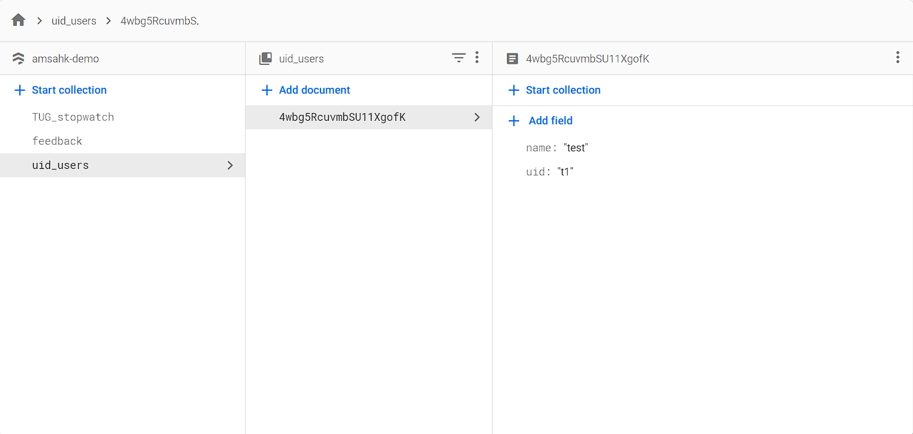
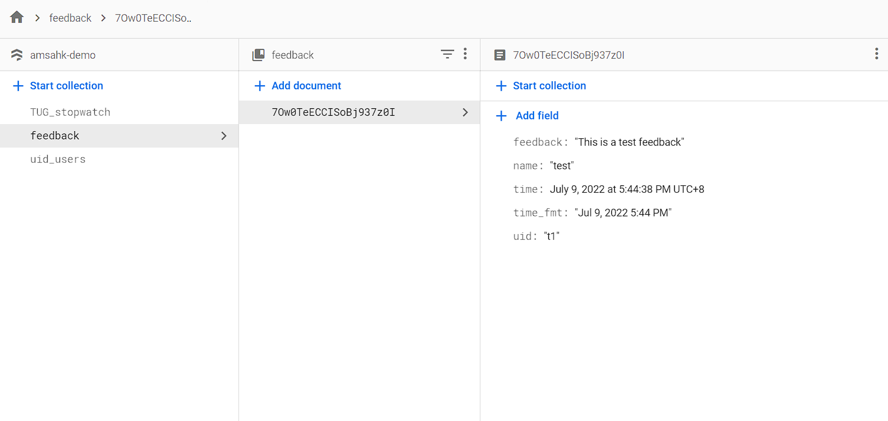
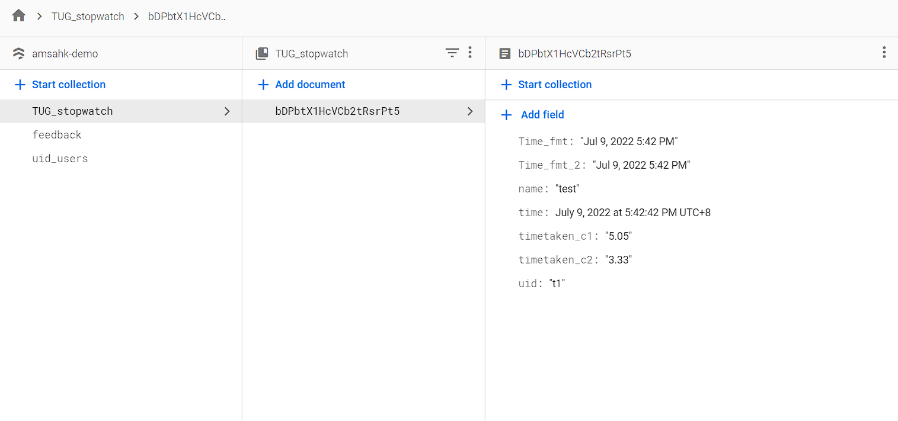
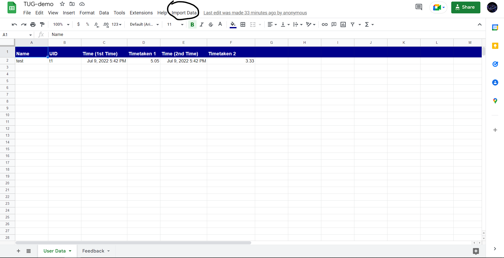

# TUG Project DEMO    

This is a simple Timed Up & Go Test, originally created for a study by AMSAHK. Please note that all the instructions and translations are provided by AMSAHK.

The website can time users while they perform a task, provide analytics *(Line Graph)* and collect feedback.

## Personalized URL
The URL of this project is https://tug-demo.netlify.app/ and is personalized based on the user based on the following schema:
https://tug-demo.netlify.app/?__name=*Name*&__uid=*UID*

A test user has been created for demonstration purposes with the following parameters:  \
Name: test \
UID: t1

Thus, the URL for the user is: https://tug-demo.netlify.app/?__name=test&__uid=t1

The parameters in the name and UID fields are also meant to be a  simple form of verification. Thus, data from only registered users is stored in the database.

Security is not a major concern for the project, thus a login system has not been implemented but since the UIDs for different users may be similar and only differ by the digit, name is also required as an added verification.

## Database

The database used in this project is **Firestore**. All user management is done using that as well. In order to create a new user, simply create a new entry in the following format in the firestore database under the uid_users collections:

The feedback and time data is also stored in the database:
Feedback | Time Data
:-------------------------:|:-------------------------:
 | 

Firestore rules have been implemented to block unauthorized activity.

## Google Sheets Automation
For easily dealing with the data, an AppScript is created for automatically fetching the collected data from firestore into Google Sheets The [App Script](./AppScripts/) can be found [here](./AppScripts/).

The Google Sheets with the added functionality can be found [here](https://docs.google.com/spreadsheets/d/1OBnqi67jDJXp0iO76bz7AZRbPAeDIYf18ryp-hK17LU/edit#gid=0).

## Analytics
An analytics page provides users with a line graph to visualize their progress.

A minimum of 7 days of data is required to access this page. The data for any missing days is generated automatically by averaging the two closest results and abnormal results that may have occurred due to accidental presses are removed *(This is done by excluding data points if the time taken is greater than 1.2 Standard Deviations from the average for the user)*.

## TODO
- Refractor Code for better readability
- Add Comments in code for better Developer Experience
- Create a guide for usage *(of the website for other projects)*

### Contact Me
Insta: *freakingrocky* \
Email: *freakingrocky@gmail.com*